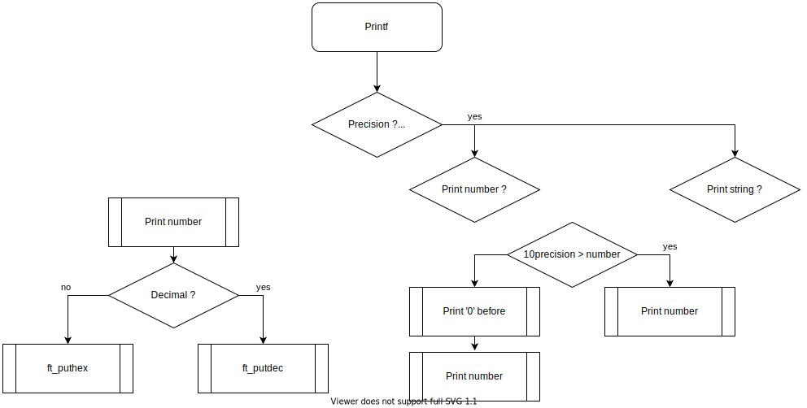

# 42-printf

Ce projet est clair et efficace. 
Vous devez recoder 
[printf](https://www.tutorialspoint.com/c_standard_library/c_function_printf.htm). 
Avec un peu de chance, 
vous serez en mesure de le réutiliser 
dans des projets futurs sans la crainte
d’être considéré comme un tricheur.
Vous apprendrez principalement à utiliser les
arguments variadiques.

[Some great informations about C operators](https://en.wikipedia.org/wiki/Operators_in_C_and_C%2B%2B)

## Bytes values

|data type		|bits	|bytes	|
|:-				|:-:	|:-:	|
|int			|32		|4		|
|unsigned int	|32		|4		|
|long			|64		|8		|
|unsigned long	|64		|8		|
|char			|8		|1		|

## Number

### Decimal

|data type		|min value				|max value				|printf letter	|
|:-				|:-						|:-						|:-:			|
|int			|-2147483648			|2147483647				|%d				|
|unsigned int	|0						|4294967295				|%u				|
|long			|-9223372036854775808	|9223372036854775807	|%ld			|
|unsigned long	|0						|18446744073709551615	|%lu			|

### Hexadecimal

|data type		|min value				|max value			|printf letter	|
|:-				|:-						|:-					|:-:			|
|int			|-7fffffff				|7fffffff			|%x				|
|unsigned int	|0						|ffffffff			|%x				|
|long			|-7fffffffffffffff		|7fffffffffffffff	|%lx			|
|unsigned long	|0						|ffffffffffffffff	|%lx			|

## String

## Char

## Flowchart

## Test

### Partie obligatoire

Gestion de conversion simple

- Testez chacune des conversion sans aucun flag 'cspdiuxX%'
- Testez les cas spéciaux, comme 0, le plus petit int, une chaine de caractères vide ou un pointeur NULL.
- Testez avec plusieurs arguments et conversions
- Essayez les différents flags au milieu d'une phrase (d'autres caractères autour)

###Soyons fous

- Refaites tous les tests mais vérifiez que la valeur de retour correspond à la valeur de
retour du vrai printf.
- Essayez n'importe quelle combinaison de conversions.
- Vérifiez ce qui se passe avec des conversions identiques à la suite.

## Bonus

Les bonus ne seront abordés que si votre partie obligatoire est excellente. 
Cela signifie que vous devez compléter la partie obligatoire, 
du début à la fin, que votre gestion d'erreur doit être parfaite, 
même dans des situations tordues. Si tous les points ne sont pas attribués 
pendant cette soutenance, aucun point ne sera comptabilisé dans les bonus.
Gestion simple des flags

- Vérifiez les flags '.', '-' et 0.
- Vérifier %-d avec INT_MIN.
- Vérifiez le flag - avec n'importe quelle valeur.
- Vérifiez le flag 0 avec par exemple %04d.
- Vérifiez le "." avec plusieurs précisions.
- Pour chaque test, la valeur de retour doit correspondre à printf.
- Pour chaque flag fonctionnel, donnez 1 point
- Si tous les flags fonctionnent, donnez 2 points.
Rate it from 0 (failed) through 5 (excellent)
"# , +, espace"

- Testez si les conversions marchent avec '#' + et 'espace' avec n'importe quelle combinaison de flags.
- Chaque flag rapporte 1 point
- Si tous les flags fonctionnent, rajoutez 2 points.
